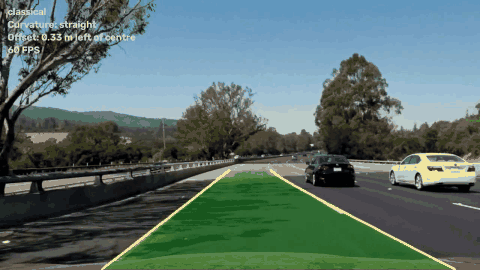
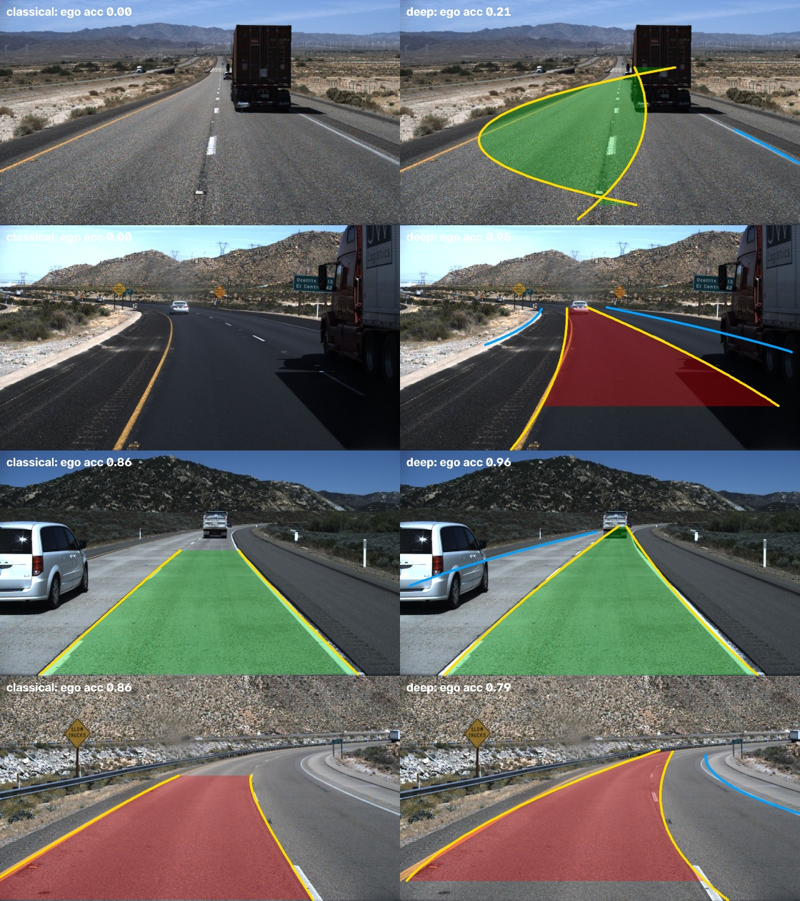
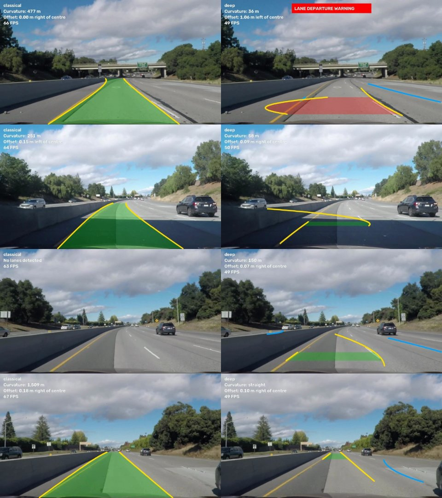
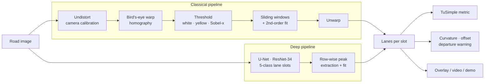

<div align="center">

# 🛣️ Lane Detection: Classical CV vs. Deep Learning

**The same problem solved two ways — a hand-engineered OpenCV pipeline (camera calibration, bird's-eye warp, sliding windows, curvature) and a U-Net lane segmentation network — benchmarked head-to-head with the official TuSimple metric.**

[](https://github.com/haroonkhan02/lane-detection-classical-vs-deep/actions/workflows/ci.yml)




<sub>Classical pipeline on the Udacity project video — lane area, curvature radius and offset from lane centre.</sub>

</div>

---

## Highlights

- **Two complete pipelines behind one interface** — both return lanes in the same format, so they share evaluation, visualization, video processing and the demo.
- **Fair benchmark** — classical parameters are tuned on the *train* split, the network checkpoint is chosen on *val*, and both are scored once on *test* with a re-implementation of the official TuSimple metric.
- **Real geometry** — camera calibration from chessboards, a homography to a bird's-eye view, and metric curvature / vehicle offset / lane-departure warning. The deep model's lanes reuse the same geometry for measurements.
- **Lane-slot segmentation** — the network predicts *which* lane each pixel belongs to (ego-left, ego-right, outer lanes), so no clustering step is needed.
- **Interactive demo** — a Gradio app shows both methods side by side plus the classical bird's-eye debug view.

## Results

Full **TuSimple test set (2,782 images)**, official TuSimple metric. Time per frame includes pre/post-processing on an Apple M5 (classical on CPU, deep on the GPU via MPS).

| Method | Ego acc ↑ | Ego FP ↓ | Ego FN ↓ | All-lanes acc ↑ | All FP ↓ | All FN ↓ | ms / frame |
|---|---|---|---|---|---|---|---|
| Classical (tuned on 1,000 train images) | 0.773 | 0.330 | 0.395 | 0.541 | 0.329 | 0.634 | **9.8** |
| U-Net ResNet-34 (30 epochs on 3,268 images, best on val) | **0.951** | **0.053** | **0.051** | **0.950** | **0.049** | **0.062** | 20.7 |

*Ego* = the two lanes bounding the car's lane (what lane keeping needs, and all the classical pipeline looks for); *all lanes* = standard TuSimple protocol (classical scores low there by design). Training took 104 minutes on the M5 (best validation epoch 28 of 30).

<p align="center"></p>
<p align="center"><sub>Hardest and median test cases. Classical (left) misses lanes whose markings are faint or occluded; the network (right) finds them and the outer lanes. Row 1 shows the network's failure mode: a lane hidden by a truck gets a hooked polynomial fit.</sub></p>

> **Retrained 2026-10-10 after a bug fix.** The 4 data-loader workers had each received a copy of the same random generator, so they drew identical augmentation parameters. With per-worker seeding (`lanedet.deep.dataset.seed_worker`) the same 30-epoch run gives ego accuracy 0.951 (before: 0.951), all-lanes 0.950 (0.948), ego FP / FN 0.053 / 0.051 (0.051 / 0.050). The fix made training correct, not measurably better. The numbers above are from the fixed run; the earlier ones are in git history.

**What the numbers say**

- On its home domain the network is far better: false positives and false negatives drop from ~33–40 % to ~5 %. Faint dashes and Botts' dots defeat brightness/gradient thresholds; the U-Net has *learned* what a lane looks like, and it also finds the outer lanes the classical design never looks for.
- **Data matters more than epochs.** The same model trained on the 233-image subset reached 0.914 ego accuracy after 60 epochs; with 14× more data it reaches 0.926 on val after 10 epochs (0.935 at best) and 0.951 on test.
- The classical pipeline is twice as fast, needs **no training data**, and every failure is explainable from its debug views. Its score barely moved between the subset and the full test set (0.783 → 0.773): it has no data to benefit from.
- **Known limitation: the departure warning on curves.** Offset is measured through a homography calibrated on straight road, so on tight bends both methods can raise false lane-departure warnings (red fill in the gallery). A calibrated camera height/pitch would fix this.
- **Neither is robust off-domain.** On Udacity's challenge video (different camera, shadows, asphalt seams) the classical pipeline locks onto the dark seam beside the barrier, and the network, trained on a different camera, produces unstable curves and a false departure warning:

<p align="center"></p>

<details>
<summary>Earlier run on the public-mirror subset (233 train / 34 val / 233 test images)</summary>

| Method | Ego acc | Ego FP | Ego FN | All-lanes acc | ms / frame |
|---|---|---|---|---|---|
| Classical | 0.783 | 0.358 | 0.401 | 0.536 | 10.5 |
| U-Net ResNet-34 (60 epochs) | 0.914 | 0.148 | 0.148 | 0.922 | 20.7 |

Reports in [`reports/subset/`](reports/subset). The domain-shift figure above was made with this subset model.
</details>

Training history (loss and val accuracy per epoch) is in [`reports/training_history.json`](reports/training_history.json); raw metrics in [`reports/results_test.json`](reports/results_test.json).

## How it works



**Classical.** Undistort with the calibrated camera model, warp the road trapezoid to a top-down view (lanes become parallel), threshold white (adaptive lightness percentile), yellow (LAB *b*) and horizontal gradients, find lane bases with a histogram, follow them upward with sliding windows and fit `x = Ay² + By + C`. In video mode it searches around the previous fit, smooths with an EMA and coasts through a few bad frames.

**Deep.** A U-Net with an ImageNet-pretrained ResNet-34 encoder segments the image into background + four *lane slots* (`left_left`, `left`, `right`, `right_right`), trained with weighted cross-entropy + Dice (lanes are ~2 % of pixels). Lanes are recovered by taking each row's probability-weighted peak per slot and fitting a low-order polynomial.

## Repository structure

```text
lane-detection-classical-vs-deep/
├── src/lanedet/
│   ├── classical/
│   │   ├── calibration.py   # Chessboard camera calibration
│   │   ├── geometry.py      # Homography (bird's-eye) + colour/gradient thresholds
│   │   ├── lane_fit.py      # Sliding windows, polyfit, curvature, offset, sanity checks
│   │   ├── pipeline.py      # ClassicalLaneDetector (image + video tracking)
│   │   ├── tune.py          # Grid-search parameters on the train split
│   │   └── config.py        # YAML-backed parameters
│   ├── deep/
│   │   ├── dataset.py       # TuSimple -> lane-slot masks, geometry-aware augmentation
│   │   ├── model.py         # U-Net, lane extraction, DeepLaneDetector
│   │   └── train.py         # Training loop (MPS / CUDA / CPU)
│   ├── tusimple.py          # Annotation parsing, slot assignment, mask rendering
│   ├── metrics.py           # Official TuSimple accuracy / FP / FN
│   ├── evaluate.py          # Benchmark both methods, write report + gallery
│   ├── measure.py           # Curvature/offset for any detector's lanes
│   ├── video.py             # Annotate videos (single or side-by-side)
│   ├── demo.py              # Gradio web demo
│   ├── viz.py               # Overlays, HUD, mosaics
│   ├── download.py          # TuSimple (HF mirror) + Udacity assets
│   └── types.py             # LaneResult shared by both detectors
├── configs/                 # Classical parameters (udacity.yaml, tusimple.yaml)
├── tests/                   # Unit tests on synthetic roads (no data / GPU needed)
├── reports/                 # Benchmark results, training history, galleries
├── assets/                  # README media
├── data/  models/           # Downloaded data & weights (git-ignored)
└── .github/workflows/       # CI: lint + tests on Python 3.10–3.12
```

## Getting started

```bash
git clone https://github.com/haroonkhan02/lane-detection-classical-vs-deep.git
cd lane-detection-classical-vs-deep
uv venv --python 3.12 && source .venv/bin/activate
uv pip install -e ".[demo,dev]"

# Data
lanes-download udacity                       # chessboards + test images + videos (~30 MB)
lanes-download kaggle                        # full TuSimple -> data/tusimple_full (needs ~/.kaggle/kaggle.json;
                                             #   downloads a 23 GB zip, keeps ~1.2 GB of labelled frames)
# no Kaggle account? `lanes-download tusimple --split train|val|test` gets the ~500-clip public subset

# Classical pipeline
lanes-calibrate data/udacity/camera_cal -o models/udacity_calibration.npz
python -m lanedet.classical.tune --root data/tusimple_full --limit 1000 \
    --output configs/tusimple_full.yaml
lanes-video data/udacity/project_video.mp4 --method classical \
    --config configs/udacity.yaml --calibration models/udacity_calibration.npz \
    -o outputs/project_classical.mp4

# Deep pipeline
lanes-train --root data/tusimple_full --epochs 30 --output models/unet_resnet34_full.pt
                                             # ~100 min on an Apple M5 (MPS)
lanes-evaluate --root data/tusimple_full --split test --config configs/tusimple_full.yaml \
    --checkpoint models/unet_resnet34_full.pt  # both methods, writes reports/
lanes-demo --config configs/tusimple_full.yaml --checkpoint models/unet_resnet34_full.pt
```

> **Dataset note:** the original TuSimple download links are dead. `lanes-download kaggle` rebuilds the full set from the Kaggle copy; the public Hugging Face mirror used by `lanes-download tusimple` only contains ~500 of the ~6,400 labelled clips.

## Design decisions

| Decision | Why |
|---|---|
| Lane *slots* instead of binary lane segmentation | The network directly tells ego-left from ego-right; no clustering or heuristics afterwards. |
| Slots assigned **after** augmentation | A horizontally flipped "left" lane is a "right" lane — assigning first would teach the model wrong labels (unit-tested). |
| Adaptive (percentile) white threshold | A fixed brightness threshold breaks between sunny and overcast frames. |
| Trapezoid fitted to median training lanes | Data-driven bird's-eye calibration for a camera with no published intrinsics. |
| Checkpoint selected on val TuSimple accuracy, not loss | Select on the metric you report. |
| Shared `LaneResult` type | Both detectors plug into the same metric, measurements, video tool and demo. |

## Testing

```bash
pytest     # synthetic roads and lanes — no dataset, camera or GPU needed
ruff check .
```

## Future work

- Train on CULane and add night & rain scenes (where the classical pipeline is expected to break down)
- Row-anchor classification (UFLD-style) for >200 FPS inference
- Temporal smoothing of the network output for video
- Deploy the Gradio demo to Hugging Face Spaces

## Acknowledgements

[TuSimple lane benchmark](https://github.com/TuSimple/tusimple-benchmark) (via the [Hugging Face mirror](https://huggingface.co/datasets/dhbloo/TuSimple)) · [Udacity CarND Advanced Lane Lines](https://github.com/udacity/CarND-Advanced-Lane-Lines) (calibration images and videos, MIT) · [segmentation_models.pytorch](https://github.com/qubvel-org/segmentation_models.pytorch)

## License

[MIT](LICENSE) © Muhammad Haroon Khan
